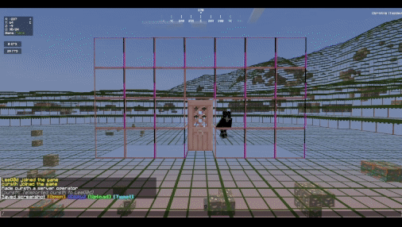

# Entity Culling

Entity culling is an **PAID** addon for RaytraceAntiXray that will cull the entities that are not visible to the player.



---
## How does it work?

Entity culling has an independent engine with block source and few other utilities shared with the core engine.
It has it own tracker system to track the entities that are visible to the player, and cull the entities that are not visible to the player.
And currently share the same thread pool with the core obfuscation engine.

---
## Where to get it?

You can get the Tile Culling addon from our [store](https://imanity.dev/resources/resource/12-raytraceantixray-%7C-entity-culling-addon/).
If you purchase from BuiltByBit, you can purchase the addon from the addon page in the [resource](https://builtbybit.com/resources/raytraceantixray-ores-entities-tiles.41896/).

### Special Offer

If you purchase the RaytraceAntiXray from [SpigotMC](https://www.spigotmc.org/resources/1-8-1-20-6-raytraceantixray-ores-entities-tiles.116253/), [BuiltByBit](https://builtbybit.com/resources/raytraceantixray-ores-entities-tiles.41896/), or [Polymart](https://polymart.org/resource/raytraceantixray.5798).
You can leave a review on the product page and get a free addon of your choice!

---
## Configuration

### Default configuration file

```yaml title="default-overworld.yml"
# This is the default config for the overworld,
# Should entity culling be enabled?
enabled: true
# The maximum distance to execute entity culling.
maxDistance: 64.0
# The bounding box expand for entity culling.
boundingBoxExpansion: 0.5
# The raytrace ticking rate for each player. (in ticks, 1 ticks = 50ms)
raytraceRate: 1
# Use Paper track entity & untrack entity events to track entities.
# This is more efficient than the default method which scans nearby entities.
usePaperEvents: true
# The entity types to be culled.
# List of entity types: https://hub.spigotmc.org/javadocs/bukkit/org/bukkit/entity/EntityType.html
entityTypes:
  - PLAYER
  - ENDERMAN
  - BLAZE
  - WITCH
  - MINECART
  - MINECART_CHEST
  - MINECART_FURNACE
  - MINECART_MOB_SPAWNER
  - MINECART_TNT
  - ITEM_FRAME
  - GLOW_ITEM_FRAME
  - PAINTING
  - PRIMED_TNT
# The special settings for each entity type for entity culling.
specials:
  # Should the player only be sneaking to be culled?
  # This is due to player having a name tag, which is still visible when blocked by blocks.
  playerOnlySneaking: true
# The update rate for each entity type for entity culling.
updateRate:
  # The default rate for all entities.
  defaultRate: 3
  # The rate when viewer is moving.
  movingRate: 1
  # The rate when target is a player.
  playerRate: 1
  # The rate when target is a projectile.
  projectileRate: 1
```

### Options Explanation
- `boundingBoxExpansion` - Expand the bounding box of the entity for raytrace calculation, this is to prevent the entity from being culled when it's partially visible. and improve the user experience when their connection is not stable.
 
- `updateRate` - The rate of the entity update, the higher the rate, the more frequent the entity will be updated, and the more accurate the culling will be, but it will also consume more resources.
- `usePaperEvents` - Basically paper has two events `PlayerTrackEntityEvent` and `PlayerUntrackEntityEvent` that can be used to track the entities, this is more efficient than the default method which scans nearby entities.
- `maxDistance` - The maximum distance to execute entity culling, if entities are further than this distance, they will simply be invisible to the player.
