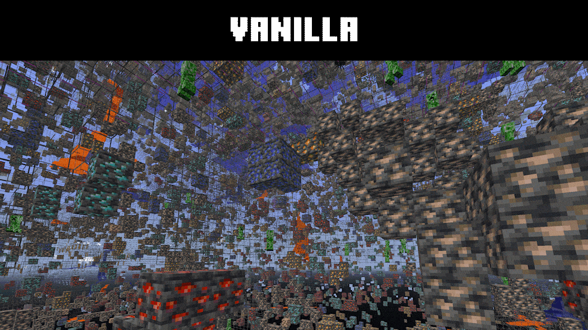
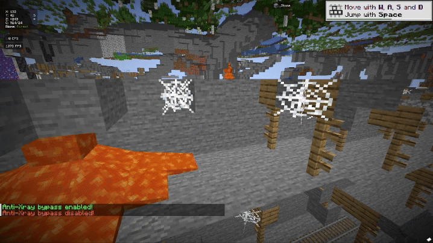
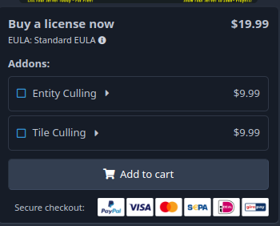
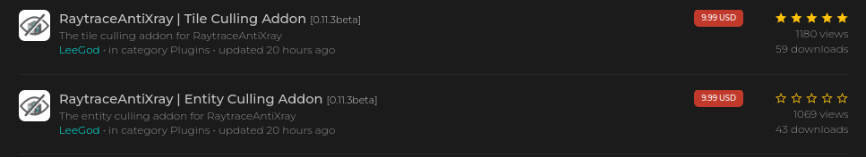

# FAQ

### Q: What is the difference between RaytraceAntiXray and Paper's Anti-Xray?
Paper's Ant-Xray only hide ores that are surrounded by blocks, because of that **all exposed ores are still visible to xray**.
RaytraceAntiXray uses raytracing to determine if the ores are visible to the player, and show/hide them runtime.
And with all the addons, essentially get rid of every advantage of ESP.

---
### Q: How to obtain my Discord Client role?

1. If you purchased from SpigotMC:
Open a conversation here: https://www.spigotmc.org/conversations/add with [this spigot account](https://www.spigotmc.org/members/leelee.41873/) as participant, and write your discord username in the conversation.
Alternatively, a profile post in this spigot profile `only if you can't open a conversation.`.

::note

to verify yourself in the title and attach your discord username in the content. we will verify it manually for you, it may take up to 24 hours!

:::

2. If you purchased from BuiltByBit:
Use `/sync` command in the Discord server.

3. If you purchased from imanity.dev:
Message your discord username to [this imanity account](https://imanity.dev/profile/LeeGod/).

::note

to verify yourself in the title and attach your discord username in the content. we will verify it manually for you, it may take up to 24 hours!

:::

---
### Q: How much memory does RaytraceAntiXray use?

Overall, RaytraceAntiXray uses around 5-10MB of memory per player with a render distance of 16 and spread across the world.
We would suggest to add 10-20% more memory to your server to accommodate RaytraceAntiXray if your memory usage was already high.

---
### Q: Why are ores visible when I open x-ray?
Those are **Fake Ore** feature of RaytraceAntiXray.
You can go ahead and try to mine them, but you will not see them disappearing before your eyes.

---
### Q: How do I have temporary access to x-ray? / Disable x-ray for a player?

You can do it by using `/antixray toggle`!

---
### Q: Where can I get all the addons?

:::info

#### BuiltByBit customers
If you purchased through [BuiltByBit](https://builtbybit.com/resources/raytraceantixray-ores-entities-tiles.41896/),
you can purchase it directly on the right side of the resource page.

:::

:::info

#### SpigotMC customers
If you purchased through [SpigotMC](https://www.spigotmc.org/resources/1-8-1-21-raytraceantixray-ores-entities-tiles-itemsadder-support.116253/),
You can purchase it through our [store](https://imanity.dev/resources/).

:::
