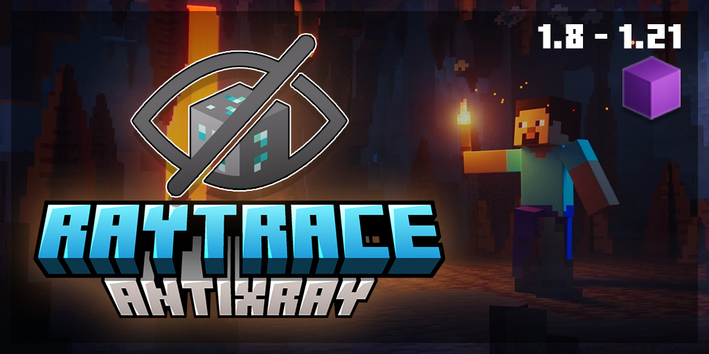

# RaytraceAntiXray

---

## Store Links 
- [Official Store](https://imanity.dev/resources/resource/16-%5B18-121%5D-raytraceantixray-%7C-ores%2C-entities%2C-tiles/) | **$16.99 USD BEST DEAL**
- [SpigotMC](https://www.spigotmc.org/resources/25-off-1-8-1-21-raytraceantixray-ores-entities-tiles-itemsadder-oraxen-support.116253/) | $19.99 USD
- [BuiltByBit](https://builtbybit.com/resources/raytraceantixray-ores-entities-tiles.41896/) | $19.99 USD
- [Polymart](https://polymart.org/resource/raytraceantixray.5798) | $19.99 USD

---

## Index
- [Commands](commands) - List of commands and permissions
- [Configurations](configurations) - List of configurations and explanations
- Addons - List of addons and explanations
    - [Entity Culling](entity-culling) - Cull entities (creeper, other players etc) from the player's view
    - [Tile Culling](tile-culling) - Cull tiles (chest, banners, etc) from the player's view
- [FAQ](faq) - Frequently asked questions