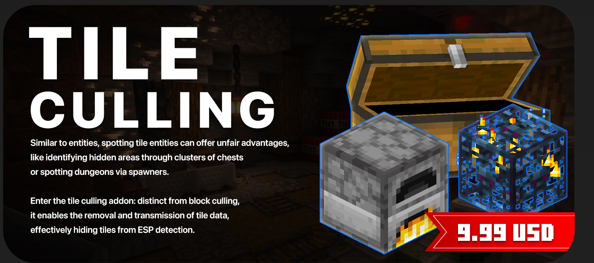

# Tile Culling

Tile culling is an **PAID** addon for RaytraceAntiXray that will cull the tiles that are not visible to the player.
Anything such as chest, furnace, hopper, etc. can be culled.


---
## How does it work?

Tile culling is an extension on top of the obfuscation engine of the RaytraceAntiXray core.
It adds additional tile entity packet handling to the engine, and culls the tiles that are not visible to the player.
A lot of settings are shared with the core engine, such as the raytrace rate, max distance, tracePlacedBlock, etc.

---
## Where to get it?

You can get the Tile Culling addon from our [store](https://imanity.dev/resources/resource/13-raytraceantixray-%7C-tile-culling-addon/).
If you purchase from BuiltByBit, you can purchase the addon from the addon page in the [resource](https://builtbybit.com/resources/raytraceantixray-ores-entities-tiles.41896/).

### Special Offer

If you purchase the RaytraceAntiXray from [SpigotMC](https://www.spigotmc.org/resources/1-8-1-20-6-raytraceantixray-ores-entities-tiles.116253/), [BuiltByBit](https://builtbybit.com/resources/raytraceantixray-ores-entities-tiles.41896/), or [Polymart](https://polymart.org/resource/raytraceantixray.5798).
You can leave a review on the product page and get a free addon of your choice!

---
## Configuration

### Default configuration file for TileCulling

```yaml title="default-overworld.yml"
# This is the default config for the overworld,
# Should tile culling be enabled?
enabled: true
# The replacement block for the obfuscated blocks.
replacementBlock: AIR
# The blocks that should be added to tile culling raytracing.
tileEntities:
  - BEACON
  - BREWING_STAND
  - CHEST
  - COMMAND_BLOCK
  - STRUCTURE_BLOCK
  - COMPARATOR
  - CONDUIT
  - DAYLIGHT_DETECTOR
  - DISPENSER
  - DROPPER
  - ENCHANTING_TABLE
  - END_PORTAL_FRAME
  - FURNACE
  - LECTERN
  - HOPPER
  - JUKEBOX
  - NOTE_BLOCK
  - REPEATER
  - TRAPPED_CHEST
  - CRAFTING_TABLE
  - BARREL
  - BELL
  - JIGSAW
  - BEEHIVE
  - SCULK_SENSOR
  - CALIBRATED_SCULK_SENSOR
  - SCULK_CATALYST
  - SCULK_SHRIEKER
  - CHISELED_BOOKSHELF
  - DECORATED_POT
  - SMOKER
  - BLAST_FURNACE
  - CRAFTER
  - SPAWNER
  - TRIAL_SPAWNER
  - PISTON
  - SHULKER_BOX
  - SIGN
  - BANNER
  - HEAD
  - BED
# The minimum block height for tile culling.
minBlockHeight: -64
# The maximum block height for tile culling.
maxBlockHeight: 320
```

### Tile Entity Types
- BEACON
- BREWING_STAND
- CHEST
- COMMAND_BLOCK
- STRUCTURE_BLOCK
- COMPARATOR
- CONDUIT
- DAYLIGHT_DETECTOR
- DISPENSER
- DROPPER
- ENCHANTING_TABLE
- END_PORTAL_FRAME
- FURNACE
- LECTERN
- HOPPER
- JUKEBOX
- NOTE_BLOCK
- REPEATER
- TRAPPED_CHEST
- CRAFTING_TABLE
- BARREL
- BELL
- JIGSAW
- BEEHIVE
- SCULK_SENSOR
- CALIBRATED_SCULK_SENSOR
- SCULK_CATALYST
- SCULK_SHRIEKER
- CHISELED_BOOKSHELF
- DECORATED_POT
- SMOKER
- BLAST_FURNACE
- CRAFTER
- SPAWNER
- TRIAL_SPAWNER
- PISTON
- SHULKER_BOX - This will cover all shulker boxes colors
- SIGN - This will cover all sign types
- BANNER - This will cover all banner types
- HEAD - This will cover all head types (player, mob, etc.)
- BED - This will cover all bed colors