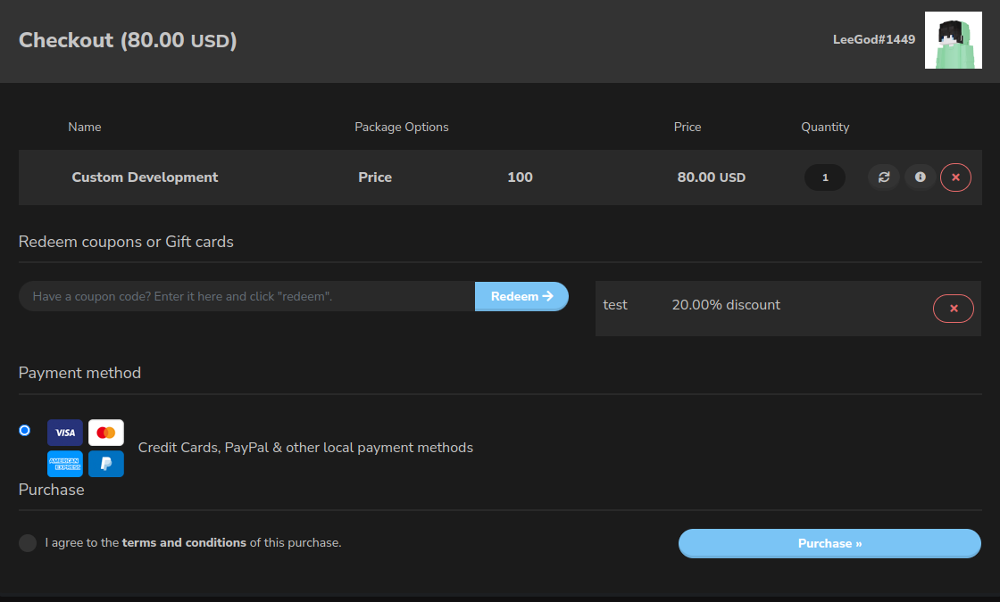

# Pricing

Here you will find our pricing for each service we offer.
The currency we use is USD, and we accept payment via Tebex Checkout.

## Base Price

All pricing listed below are the base price for each service from scale small to large.
It's for **reference only**, and the actual price may vary depending on the features you requested.
But you can use this as a reference to estimate the price for your order.

| Service          | Small | Medium | Large |
|------------------|-------|--------|-------|
| Minecraft Plugin | 10$   | 60$    | 150$  |
| Discord Bot      | 10$   | 60$    | 150$  |
| Web Backend      | x     | 100$   | 250$  |

### Scale Explanation 
- **Small** means that the plugin is pretty simple, a command or two, simple menus, and simple features.
  - Your order can be expected to be delivered within 1 ~ 2 days normally.
- **Medium** means that the plugin is a more complex, semi-complex game mechanics, features, or a very simple mini-game such as Spleef.
  - Your order can be expected to be delivered within 3 days ~ 1 week normally.
- **Large** means that the plugin is a large scale game mechanics, core, a large scale mini-game, or anything beyond that.
  - Your order can be expected to be delivered within 1 week~ normally.

The real world case is never just small, medium, or large! your project may be in between 2 sizes.

### Example

Use the real world projects we owned to explain the scale of each project.

- [WoolWars](https://github.com/Imanity-Software/woolwars) a complex mini-game with high customization, and a lot of features, is a large project.
- [ImanityPracticeAddon](https://github.com/Imanity-Software/ImanityPracticeAddon) a plugin that connects API of a lot of practice core, may fall to small project or small to medium if you request to connect with a lot of practice core.

## Optional 

Here is the optional service for every service we offer.
Anything listed below is optional, and you can request it to be added to your order.
**If you didn't request any of the optional features, it won't be added to your order by default.** 
The pricing listed below are mostly multiplier, and will be applied to the base price of the service.
For example your base project is 100 USD, and you requested 2 optional features, which is 10% and 20% of the base price, the total price will be 100 + (100 * 10%) + (100 * 20%) = 140 USD.

### Applied to all services

| Content                                | Pricing  |
|----------------------------------------|----------|
| After-sale support                     | 10%      |
| Style customization (messages.yml etc) | 25%      |
| API interface                          | 0% ~ 15% |

Explanation:
- **After-sale support** means that you will be able to contact us for any issues regarding your order after it is delivered.
- **Style customization** means that you can request to change the style of the order, such as the messages, embeds, etc. normally this is only available for Discord bots and Minecraft plugins.
- **API interface** means that you can request to add an API interface to your order, it may be a REST API, or a Java API, or any other kind of API. This will only be 0% if your order is only for an API to be used by other plugins (TablistAPI etc.), otherwise it will be 15%. 

### Applied to Minecraft Plugins

| Content                                | Pricing |
|----------------------------------------|---------|
| Wide server version support            | 20%+    |

Explanation:
- **Wide server version support** means that we will support your order for all the server versions that we support, which is 1.8.8 ~ 1.19.3. (This may add dependency such as ProtocolLib)

## Discount

All the pricing above doesn't contain any discount, and the actual price may vary depending on the discount (sale, coupon, etc.) you have.

If you have a coupon, you still need to write the full price in the order form, and put your coupon code in the coupon code field.

