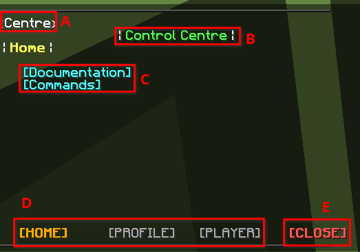
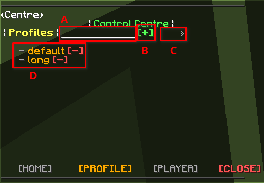
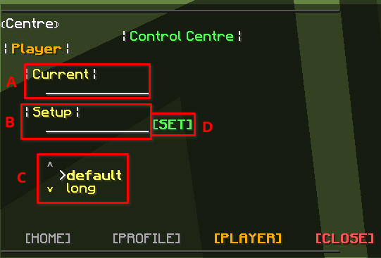
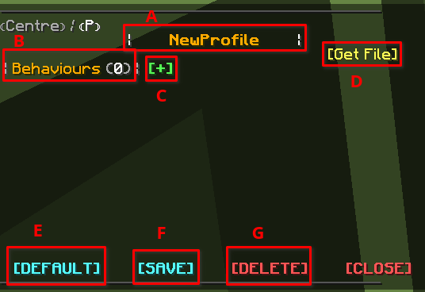
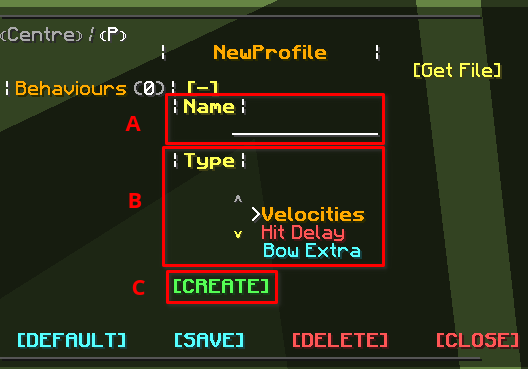

# Getting Started

Start learning our knockback system! 

In our latest implementation of Knockback editor, we use the new **"Knockback Control Centre"**

A knockback editor system that uses chat as an interface and provides the ability to edit knockback without knowing any
command!

---

## Control Centre

1. **Start Editing**  

   There To start the Knockback Control Centre, you can simply execute the command /kb, and you should receive a bunch
   of message like shown below. 

   

   Let me explain each one by one.  
   **A.** The indexes of the Control Centre, you can directly click the index to go back to a specific interface. For
   example, if You are inside a knockback profile interface and want to go back to the Control Centre, You can just
   click the &lt;Centre&gt; to go back.  
   **B.** The current interface title. In the example, it shows that we are in the Control Centre.  
   **C.** On this page, You should find some buttons that might be clickable or just some messages. You may be able to find
   some helpful information on this page.  
   **D.** The pages that Control Centre has, You can click on these buttons to go in different pages. Home is the current
   page shown in the image. Profile is the page that shows you every profile. You can view, create, and delete profiles
   here. Player is the page to view and edit the player's profile.  
   **E.** The button to close this interface, It will be shown in every knockback related interfaces.

2. **View Profiles** | Click on **\[PROFILE\]**
   
  

   Let's also explain it a little.  
   **A.** The place to let you write a name for your new knockback profile. Simply click on it, and it should be greyed out.
   Meanwhile, you can type the name into chat. After that, you can click on B to create the profile based on the name.  
   **B.** The button to create a profile based on the name in A  
   **C.** The buttons to go into previous/next page if you have a lot of profile that one page couldn't fit in.  
   **D.** The profile list. You can click the name to go in the knockback editor interface. And the red button on the right is the button to delete the profile.

3. **View and Edit Players** | Click on **\[PLAYER\]**

   
   
   **A.** The place to let you check player's current profile. Simply enter the name and it should shown on the right of the
   text input block.  
   **B.** The place to set up a profile to a player. In here you can write the name of the target player.  
   **C.** Select the profile you want to set up to the target player.  
   **D.** After you finished B and C, click on the button to apply the setup.

---

## Build a Profile

1. **Create a profile**  

   Create a profile is relatively simple. Go to \[PROFILE\] page, write a name for the profile, click create button, and
   here you go! You can click into details to start working on the profile.  

   <iframe width='720' height='405' src="https://www.youtube-nocookie.com/embed/DVqjgsLxvIc?&theme=dark&keyboard=1&autohide=2&modestbranding=1&fs=0&rel=0"frameborder="0"></iframe>

2. **Profile Interface**

   By reading this, We assume that you've already read Knockback Structure Page.  
   Let see the interface of profile first

   

   **A.** The profile names. You can click it to edit the name of the profile.  
   **B.** Behaviour List, you can see every behaviour in this profile here.  
   **C.** The creation button for behaviour. When you click on it, a creation interface will pop up. We will explain it later on.  
   **D.** The button to upload the JSON data into a paste website. It is very useful when you want to share your profile.  
   **E.** The button to set this knockback profile as a default profile.  
   **F.** The button to save this knockback profile.  
   **G.** The button to delete this knockback profile.

3. **Create a Behaviour**  
   To create a behaviour, You can click the button \[+\] from the last step. We should see this creation interface pop
   up

   

   **A.** The place to write a name for the behaviour.  
   **B.** The place to pick behaviour type. You can hover to the behaviour name to see it details and what it does. For this
   getting started series we will pick Velocities first.  
   **C.** When you finish A and B, You can click this button to create the behaviour.  
   <iframe width='720' height='405' src="https://www.youtube-nocookie.com/embed/QFwdiPd0Mrw?&theme=dark&keyboard=1&autohide=2&modestbranding=1&fs=0&rel=0"frameborder="0"></iframe>

4. **Behaviour Interface**

   Now we can click into the behaviour to start get on working!  
   First you can click into the behaviour, and you should receive this interface

     
   **A.** Similar to profile interface, It's the name of the behaviour. And you can also click it to rename it.  
   **B.** The information about this behaviour. You can see behaviour type, activate state, and behaviour description
   here.  
   **C.** Every variable you can edit in this behaviour. You can hover to these variable to see it description. And clicking
   on the variable value, the value will be greyed out, And you can input the new value in chat.

5. **Basic Variables to Edit** 

   While you click into this behaviour, you may be a bit confused. There is too many variables! 
   If you are new to knockback, It is not necessary to understand every variable, there is 4 variables being
   the most important! Which is Horizontal, Vertical, Extra Horizontal, and Extra Vertical. So let get a basic
   understanding to these variables.

   **Horizontal** means the knockback amount it does for X, Z. If we set Horizontal to very high, and You hit the player
   who applied with this knockback profile, the player will knockback backward very hard! On the opposite, If you set
   Horizontal to 0, the player will not move backward at all.