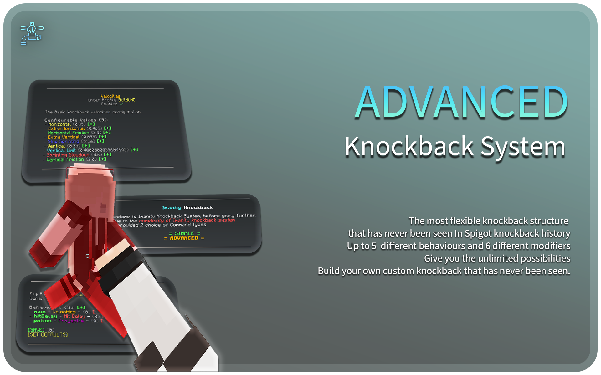
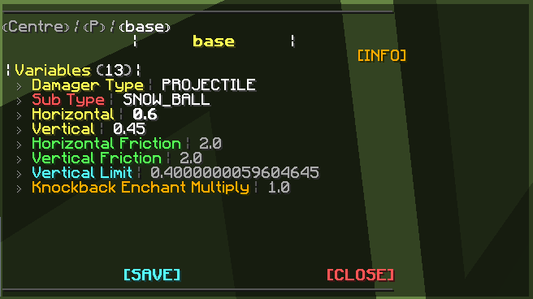
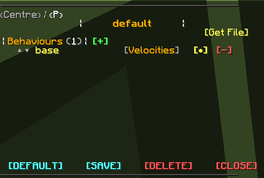
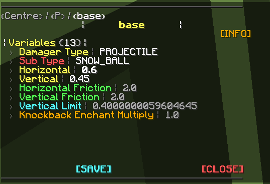
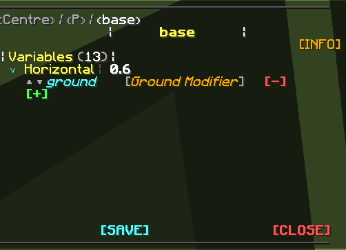
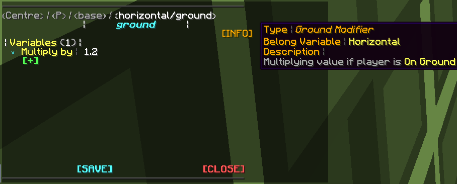

# Overview

The overview of our Knockback system!

## About Knockback

To achieve a good and flexible knockback system,
We've made the system much more complex than any knockback system that exists on the market.
But in the end, it causes some unfriendly issues for people looking for a quick and easy solution for Knockback,
So we've separated the editor into two modules: **Advanced** and **Simple**.

---

### Commands

| Command           | Alias  | Description                                                  | Permission              |
|-------------------|--------|--------------------------------------------------------------|-------------------------|
| /knockback        | /kb    | Main Command for Knockback                                   | `imanity.command.kb`    |
| /setknockback     | /setkb | The Command to apply knockback profile to a player           | `imanity.command.setkb` |
| /currentknockback | /curkb | The Command to check current knockback profile from a player | `imanity.command.curkb` |

---

### Knockback Presets

Looking for Quick solutions? Try our [**knockback
presets**](https://imanity.dev/resources/category/2-knockback-configurations/)!

**[NoDebuff (PotPvP)](https://imanity.dev/resources/resource/6-official-imanityspigot3-nodebuff-knockback-profile-set/)**

---

### Frequently Asked Question

#### Should I use V2 or V3 Editor?

If you are just looking for a ***classic way*** to edit Knockback, You couldn't understand how v3 works, or you think it
took too much effort to do, use V2 without a doubt. V2 is basically a classic command editor, If you feel that V2 does
not fit your requirement, or you want to try out how our V3 Knockback works, You can use the V3 one

#### Do you suggest people edit the knockback directly from the File?

No, very not recommended, unless you are editing knockback in V2, the Knockback structure is optimized for editor usage.

For example, adding behavior from the editor will automatically generate variables to file.
However, in file editor you need to write it manually, so use editor is better for configuring.

#### When I modified an option in knockback (Such as Hit Delay) nothing seems to be changed, Did I do anything wrong?**

Please make sure that you have the knockback profile applied to the player. Use `/curkb <player>` to check player's
current knockback profile.

If they are not using the profile you modified, Use `/setkb <player>` to apply the profile.

#### It's so pain to type commands one by one for modifying Knockback... Why do you make it so hard to use?

You don't need to type commands one by one! In our Knockback Centre, a lot of things are **intractable**! You can click
the option to modify it, that is how it being designed!

#### I previously was using ImanitySpigot2, is it possible to use my old kb in ImanitySpigot3?

**Yes!** You can import your old kb by using the Knockback Importer. Please check the showcase video below.

:::note
This only works on knockback that was **Advanced** module.
:::

---

## Knockback Structure

The Knockback Structure has been separated into 3 parts.

[**Knockback Profile**](#knockback-profile), [**Knockback Behaviour**](#knockback-behaviour) and [**Knockback Value
Modifier**](#knockback-value-modifier)

### Knockback Profile

*(Example Profile in Advanced Editor)*

You can see Knockback Profile as the package of knockback Behaviour. You can add an unlimited amount of Knockback
Behaviour to a Knockback Profile. Knockback System will iterate to all Knockback Behaviours in the Knockback Profile and
calculate the final result. In this Layer, all you have to do is to name the Knockback Profile, Add Knockback Behaviours
you need, and apply the Profile to the player

### Knockback Behaviour

*(Example Behaviour in Advanced Editor)*

Knockback Behaviour is the layer you will spend most of your time on. There are currently 5 different Behaviour Types
you can add.
Each Behaviour has its own aspect of calculating.
They are **Velocities**, **Hit Delay**, **Bow Extra**, **Projectile**, and **Vanilla**. Each of them has its own options
to configure.
For example, **Velocities** has the opportunity to configure the Horizontal, Vertical of the Knockback, Hit Delay can
configure...
as the name said, Hit Delay, etc. They all weren't inside an Advanced generated Knockback.
You have to add them individually. For example, If I don't want to set any Hit Delay on a Knockback Profile, I simply
don't want to add the Behaviour in

### Knockback Value Modifier

*(Example Modifier in Advanced Editor)*

The Knockback Value Modifier is the Layer to provide each option's dynamic values based on the situation. And a Modifier
will be attached to an option. For example, I want to change Horizontal of the Knockback if Damager drank speed potion,
then I can add Speed Modifier to the option Horizontal. There are 6 different modifiers, Randomize Modifier, Ping
Modifier, Rod Modifier, Hit Delay Modifier, Ground Modifier, and Speed Modifier. You can check what each of them does in
their description.

### Frequently Asked Question

#### What kind of option I can apply a modifier on?

Any configurable option in knockback behavior or modifier, yes modifier's own option can be applied with modifiers too.