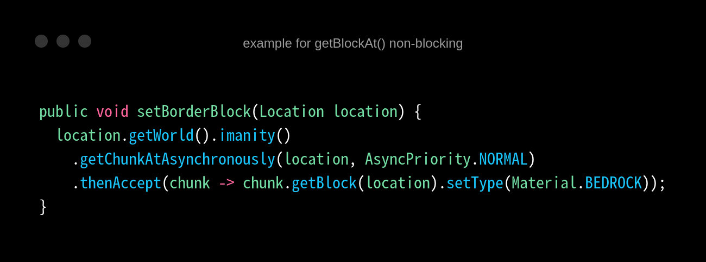

# Optimization Tips

Introduce you to some tips for optimizations on ImanitySpigot3.

These may be applied to normal spigots too

## Basics

Here are some very basic tips that we think every server hoster should at least knows about, they may seem simple but
would greatly improve your server performance compare to what you know nothing about.

### 1. Use Aikar's GC Startup Flag

https://docs.papermc.io/paper/aikars-flags

If you don't know what startup flags is, just like you start a server you require to use commands
like `java -jar server.jar` to execute the server Jar file, and inside them we can add flags to configure server or JVM
settings. And Aikar's Optimized G1GC Flag will greatly improve garbage collector to made it clean up memory and prevents
lag spikes while happening. It should always improve server performance in most of cases, *"these startup flags made my
server worse."* is a weird and unclear statement.

### 2. Use ImanitySpigot3 Lazy Configuration Set

https://imanity.dev/resources/resource/4-official-imanityspigot3-lazy-configuration-optimize-set/

The Lazy Configuration Set is simply an optimized configs for you to apply for performance improvement, You may want to
change some options based on your server such as ports

### 3. Prevent Synchronized Chunk Load or Generation (Basic)

Synchronized Chunk Load and Generation is very costly for a server, it's a common cause for lag spikes. And it often say
unnoticed since those existing performance analyze tool is stands for overall running performance instead of lag spike
detection *(There is a Lag Spike Detection tool for Premium Plan, take a look at [Here](https://docs.imanity.dev/).)* So
due to the case, we have designed a tool to catch synchronized chunk loads, So we can notice when it happens.

#### Enabling Synchronized Chunk Load Catcher

In order to have sync chunk load catcher on, You will need to add `-Dimanity.debug-sync-loads=true` startup flag and
enabling `asyncChunkLoads.enabled` to true. After all of these restart your server, and you can start using it by
following *[Command Guide](commands.md).*

#### Recognize Issue Sources

If you aren't a developer it might be difficult to recognize or even fix an issue for this case, But we are hoping you
at least know what plugin causes it, So below we will give you an example of what may cause it. So a normal sync load
catcher format looks like this:

```json
"worlds": [
{
"name": "the World",
"stacktraces": [
{
"times": 100,
"stacktrace": [
"A",
"Bunch",
"of",
"Lines"
],
"coordinates": [
"(0, 0): 5",
"(1, 1): 95"
]
}
]
}
]
```

Most of them are pretty intuitive, the name stands for the name of the world, and coordinates stand for the chunks
coords that has the cause, The most important thing is the stacktrace, which also not really hard to read. So here we
want to provide you some tips to find the source of the cause.

The Stacktrace from ImanitySpigot3: Lines start with `net.minecraft.server.v1_8_R3.` `org.imanity.imanityspigot.`

Example: `net.minecraft.server.v1_8_R3.World.d(SourceFile:728)`

The Stacktrace from Java: Lines start with `java.`

Example: `java.util.concurrent.CompletableFuture.uniAccept(CompletableFuture.java:670)`

So if you see the stacktrace and only seeing 2 types of Stacktrace from above, It may be caused by ImanitySpigot3  
If you see any stacktrace that isn't from Java or from ImanitySpigot3, that means it may be caused by Plugins  
For example you saw a line of stacktrace looks like: `me.myPlugin.MySpecialPlugin.loadWorld(SourceFile:124)`  
It is from Plugins without doult. Note that the order of lines doesn't matter, even if the line of the plugin is very
below it can still be the cause.

If you couldn't figure out what may be the cause, you can always ask with the stacktrace you have in our discord
server  
And if you figured out it was from a plugin you have, send this documentation page to the developer to
read [Advanced Optimization Tips 1](#prevent-synchronized-chunk-load-or-generation-developers) for them to improve it
for fitting the async chunk structures

Although We mostly want chunks load and generation to be as asynchronized as possible, but if you don't have performance
issue with it, Then you may not need to deal with it

## Advanced

The Advanced Optimization Tips may is target for experienced server maintainers, you may need some experience for Java
and Bukkit Development in order to understood some of the Tips

### 1. Prevent Synchronized Chunk Load or Generation (Developers)

You may want to read [This Tip](#prevent-synchronized-chunk-load-or-generation-basic) before reading this.

So you are reading this, we assume that you understood how it works, and the code you written is causing the issue you
wanted to know how to fix it, It's pretty simple. Our Goal is to made chunk asynchroized load, so let us see an example
of how we can replace a blocking code to an async code

#### `getChunkAt()`


This is an example of Blocking code that loads chunks synchronized since this method assumes that we can get the chunks
immediately after we called it, so async chunks will not help us in this case. unless you know that the target chunk is
loaded when you are calling this, otherwise we always want to prevent this kind of code


This is the correct example of correctly asynchroized, non-blocking codes. and
using [CompletableFuture](https://www.baeldung.com/java-completablefuture) chain to receive the result we are looking
for. as we are running getChunk asynchroized, we don't want to wait for the chunk to be loaded so we couldn't return the
result immediately. Although It made the codes look a little bit more not very intuitive, It's the cost to do
asynchroized structure on Java


This is the worst code out of 3 of these... You are doing all correctly on every step, but you joined the
CompletableFuture in the last step, which means you are doing it asynchronized... BUT YOU DECIDE TO WAIT FOR IT UNTIL IT
IS DONE. It's the same or even worse than doing it entirely in main. There is no magic 1 method asynchronized and finish
immediately. If you did something like this... you may want to re-learn how multi-threading works.

#### `getBlockAt()`

Obviously, if you want to get a block at some position, you will need to get the chunk first, so calling it also may
load chunks in the main. We can prevent it by getChunkAtAsynchronously() first and get the block inside. Here's an
example



#### `teleport()`

A lot of people don't know that teleportation does load chunks for the target position, The suggestion for this part is
similar to the getBlockAt() part, But we would suggest you
use [our fork of PaperLib](https://github.com/Imanity-Software/PaperLib) instead. PaperLib provides a function that let
you do async chunks related works effortless, For teleportation for example you can use PaperLib.teleport() to do the
teleport job, and it will maintain non-blocking chunks for you, It also supports another version so if you want
cross-version support it would be helpful.