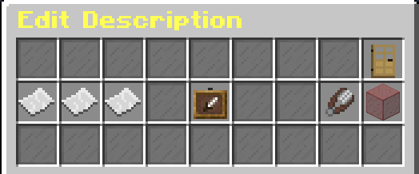

# Create Kit

Creating a new kit is simple and easy.

Our kit setup gui provides all the options at once, so you can easily
manage all of them in one place, instead of setting up with complex commands.

## Demo kits

WoolWars has 3 default kits installed and ready to go!

You can instantly view all the kits by typing `/wl kit list`!

## Video tutorial

Coming soon!

<!--

<iframe width='720' height='405'
src="https://www.youtube-nocookie.com/embed/aiaIu377stc?&theme=dark&keyboard=1&autohide=2&modestbranding=1&fs=0&rel=0"frameborder="0"></iframe>

-->

## Creating a kit

:::caution before continue

**Kit ID** are **case-sensitive**, and **you can't change it later.**

For example, if you created by kit with name `aBcD`. Your kit ID will become `aBcD`.

The kit ID will be used in anywhere include [Placeholders](placeholders), [Message](configurations/#messages), etc.

:::

Create a kit by executing this command: `/wl kit create <kit id>`.

### The kit setup menu

The kit setup menu should popup after the command has been executed.

`

:::tip

To open the menu again, execute this command: `/wl kit edit <kit id>`.

:::

### Editing kit contents

Open your kit setup menu, and click **`Edit Contents`**.

You will now entered kit edit mode.

`/woolwars kit save` to save the kit.

`/woolwars kit cancel` to cancel editing the kit.

`/woolwars kit goalBlock` to get the goal block placeholder item.

When you have finished editing the contents of the kit, type `/woolwars kit save' to save it.

:::info

All potion effects will be recorded and applied to the kit.

:::

### What is goal block? {#goalbock}

**Goal Block** is an item that can be used in the editing of the kit. Use the `/woolwars kit goalblock` command to get it.

The item slot of the goal block will be replaced by [**the goal block of the team**](arena#setting-team-goal-block).

### Edit icon

Hold the item you want in your hand, kit setup menu, and click **`Edit Icon`** to set the icon.

:::note

The kit icon will be visible in the kit selection menu and in the kit list.

:::

### Edit max uses

The **Max Uses** is the number of times the kit can be used by player in each round.

:::caution

You must have the Max Uses set to at least **1**. Otherwise, the kit will be unusable.

:::

### Changing display name

Open your kit setup menu, and click **`Rename`**.

Type the display name you want in chat!

### Edit kit description

Editing kit descriptions is simple and straightforward. It can all be done in-game!

You can...
- Add a line
- Add a new line between the line
- Edit a line
- Remove a line between line
- Clear all description
