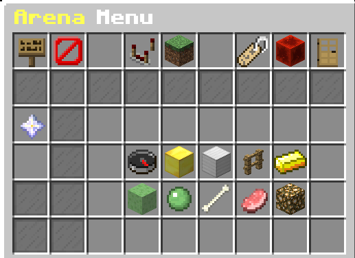
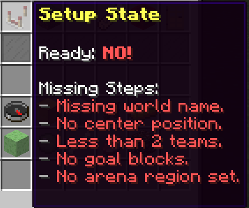
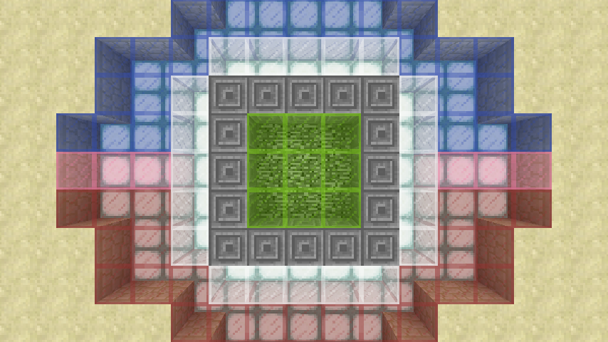
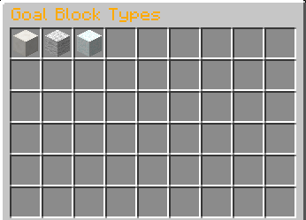
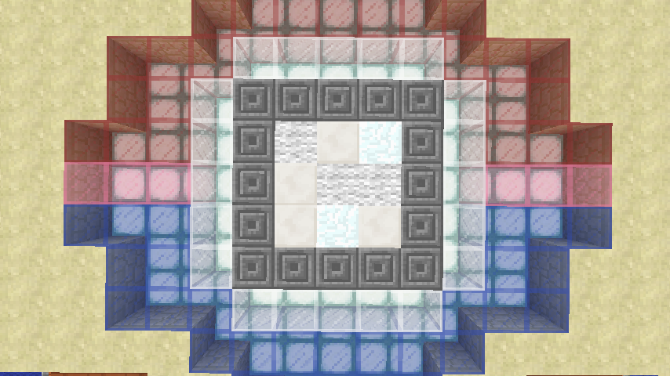
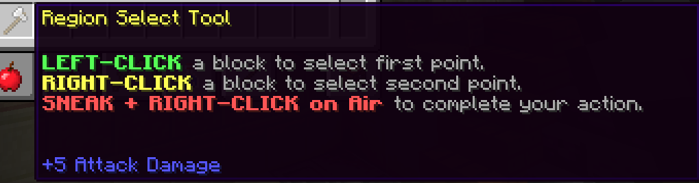
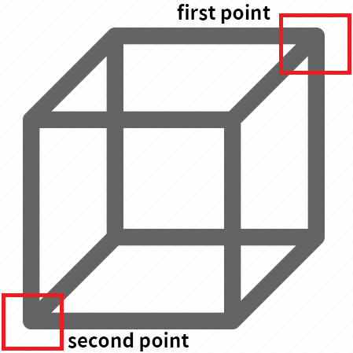
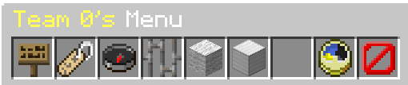
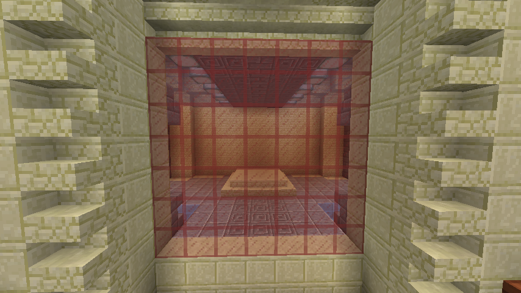

# Making an arena

:::caution before continue

This tutorial presumes that you already have a world with your desired map, and that it is placed in your server root
folder.

If there is an existing uid.dat file in the world folder, then you must delete it before continuing.

:::

Setting up a new arena is simple and easy.

Our arena setup menu provides all the options at once, so you can easily
manage all of them in one place, instead of setting up with complex commands.

## Demo arena

WoolWars has a demo arena installed and ready to go!

The demo arena is designed to give you an idea of what WoolWars can do, and it comes with 3 default kits created for
you. 

You can instantly join the demo arena by typing `/wl join demo`!

## Video tutorial

<iframe width='720' height='405'
src="https://www.youtube-nocookie.com/embed/aiaIu377stc?&theme=dark&keyboard=1&autohide=2&modestbranding=1&fs=0&rel=0"frameborder="0"></iframe>

## Creating the arena

Create the arena by executing this command: `/wl arena create <arena name>`.

### The arena setup menu

The arena setup menu should popup after the command has been executed.

:::tip

To open the menu again, execute this command: `/wl arena edit <arena name>`.

:::

### Setup state

Setup State will show you all the steps you need to complete before you can allocate your arena into the game.

### Setup world

To set up your world, click **`World`**. Enter a world name and click **`Confirm`** to load that world.

If you enter a world name that does not exist in the folder, it will create an empty world for you.

### Center location

Stand where you would like to have the player spawn when in the lobby or spectate, and
look in the direction that you want your players to be oriented.

Open your setup menu, and click **`Center Location`** to set the center location.

### Goal block

Open your setup menu, and click **`Goal Blocks`**. You will then receive a multi block select tool.

`Left click` a block to add and `Right click` a block to remove.

:::tip

Blocks that is highlighted as **`Green Stained Glass`** are valid goal blocks.

:::

An example of selected goal block region:

### Goal block type

Open your setup menu, and click **`Goal Blocks Type`**.

`Add Items to the inventory` to add them to the goal type.

`Remove Items from the inventory` to remove them from the goal type.

`Close the inventory` to confirm the changes.

An example how goal block type work:

### Arena region

Open your setup menu, and click **`Arena Region`**. You will then receive a region select tool.

To set the first point, go into the first corner of your map and `left click` the block.

To set the second point, go into the second corner of your map and `right click` the block.

After both position are selected, `Sneak + Right click on air` to complete the action.

:::info Positions

`first point` is one corner of the arena and `second point` is the corner of the arena, that is opposing to first
point!

:::

### Score required

The number of times you need to score in order to win the game.

## Adding teams

Now it's time to add the teams. To add a team, open the arena setup menu and click **`Add a new team`**.

:::caution

You must have at least 2 teams.

:::

### Setting teams

Click the team you want to edit, it will open the team menu editor.

:::tip

To open the team edit menu again, execute this command: `/wl arena edit <arena name> [team id]`.

:::

### Setting team spawn location

Stand where you would like to have the team spawn, and
look in the direction that you want your players to be oriented.

Open your team menu, and click **`Spawn Location`** to set the spawn location.

### Setting team gate region

Open your team menu, and click **`Gate Region`**. You will then receive a region select tool.

To set the first point, `left click` the block to be the first corner of your gate.

To set the second point, `right click` the block to be the second corner of your gate.

After both position are selected, `Sneak + Right click on air` to complete the action.

### Setting team goal block

Hold the block you want in your hand, open your team menu, and click **`Goal Block Type`** to set the team goal block.

:::note

Team goal block are used by team by placing them in the goal block region.

:::

### Setting team gate block

Hold the block you want in your hand, open your team menu, and click **`Gate Block Type`** to set the team gate block.

An example by using Red Glass as a team gate block.

