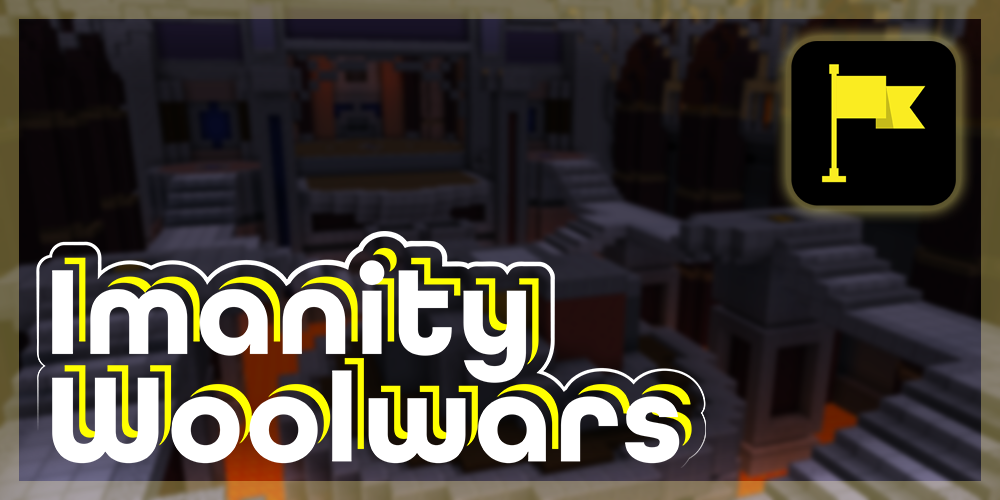

# WoolWars

## What is WoolWars? {#what-is-woolwars}

A competitive arena game that players split into 2 team teams. Players have to fight for the center control point.
Whoever filled center area with their wools, wins the round. Once the round has started, the two teams will be released
into the arena to battle each other, collect power-ups from around the map, and
replace the control point with their team's coloured wool. Rounds are played at a fast pace and players will only
respawn in the next round if they are killed. The first team to win all three rounds will be the winner of the game!

## Features {#features}

- 1.8.8 - 1.19.2 Support.
- Flat file and MongoDB support.
- Interactive arena customization.
- Interactive kit customization.
- Customizable messages with sounds, titles, and actionbars.
- Customizable scoreboard sidebar.
- Built-in player team nametag.
- Fully featured statistics system.
- 3 default playable kits.
- 1 default playable arena.
- [PlaceholderAPI support with 52+ placeholders.](placeholders)
- [Developer API](api) with documentation.
- 4 extra modules with features such as power up, jump pads.

## Installation {#installation}

### Plugin {#plugin}

1. Build a basic spigot server with the version you wanted.
2. Drag `woolwars-plugin.jar` to plugins folder.
3. Launch the spigot server.
4. Join the server and run `/wl join` to play the demo arena!

### Modules {#modules}

1. Follow the [Plugin Installation](#plugin) part at least once.
2. Drag the modules .jar to `plugins/WoolWars/modules` folder.
3. Reboot the spigot server.
4. Check `/wl modules` to ensure the module is installed. 
5. You can see new configurable option from arena setup menu now!

